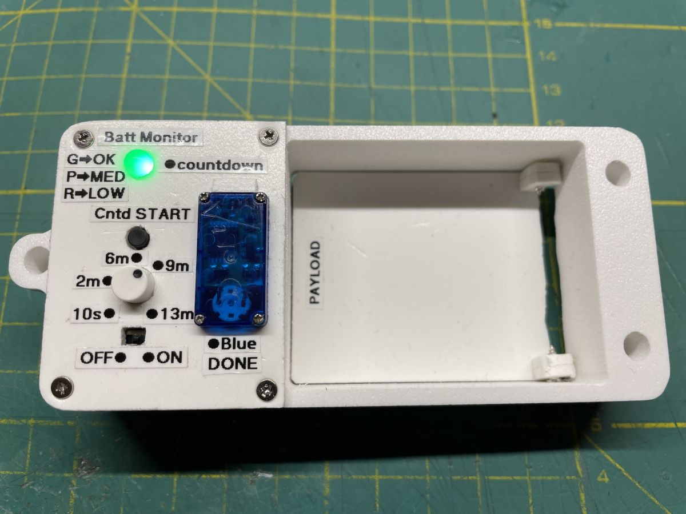

# PIC10F222_Servo_Timer_with_Neopixel
PIC10F222 – Servo Timer 10. seconds to 13. minutes with Battery Status (WS2812 LED)

 Function:
 - At power-up, sample internal 0.6 V reference (VBG) to estimate VDD and show battery status on WS2812 (GP2):
   green = high , Purple = medium, red = low.
 - Potentiometer on GP1/AN1 sets countdown time from 10.seconds to 13. minutes, then LED blinks during countdown.
 - Servo on GP0 goes from most left position to most right position after countdown end.
 - Button on GP3  starts countdown; pressing again returns to and move servo to most left position

 Control:
 1) Power on: LED shows battery color (based on single VBG read).
 2) Press button: read potentiometer, start countdown LED blinks.
 3) When time elapses: LED turns solid blue, servo switches to 2 ms. Press button to return to WAIT.

 Pins:
 - GP0: Servo signal (OUT)
 - GP1/AN1: Potentiometer wiper (IN)
 - GP2: WS2812 data (OUT)
 - GP3: Button input (IN, pull-up)

 Notes:
 - Battery level is read once at startup; timing is ratiometric (pot vs VDD), so it does not drift with battery voltage.

 Trapdoor dumper :-)
 
